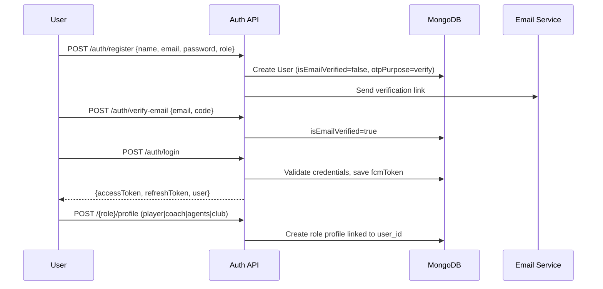
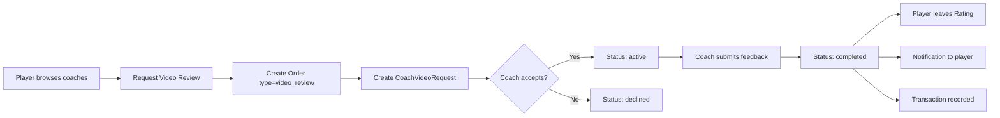
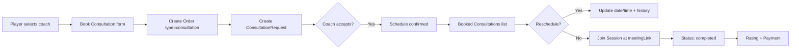
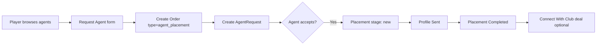
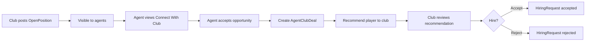
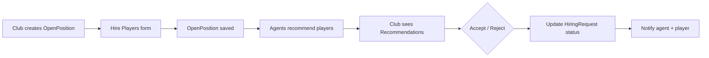
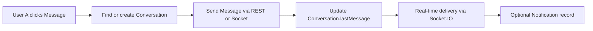
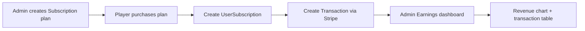
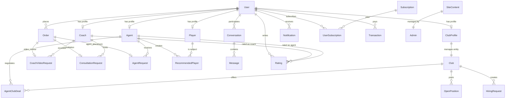

# Football Evolution Hub — Backend & Database Design Document

> **Source of truth:** 73 Figma export screens in `design_src/`  
> **Platform name:** Evolution Hub / Football Evolution Hub  
> **Stack:** Node.js · Express · TypeScript · MongoDB · Redis · Socket.IO  
> **Document purpose:** Describe how the platform works end-to-end, how data flows between roles, and the complete MongoDB schema required to power every screen in the design.

---

## Table of Contents

1. [Project Overview](#1-project-overview)
2. [System Architecture](#2-system-architecture)
3. [User Roles & Portals](#3-user-roles--portals)
4. [Design Screen Index](#4-design-screen-index)
5. [Core Business Processes](#5-core-business-processes)
6. [Entity Relationship Overview](#6-entity-relationship-overview)
7. [Complete Database Schema](#7-complete-database-schema)
8. [Status & Workflow State Machines](#8-status--workflow-state-machines)
9. [API Design (Target)](#9-api-design-target)
10. [Screen → Collection Mapping](#10-screen--collection-mapping)
11. [Implementation Status](#11-implementation-status)
12. [Build Order Recommendation](#12-build-order-recommendation)

---

## 1. Project Overview

Football Evolution Hub is a **multi-sided marketplace** connecting:

| Actor | Goal |
|-------|------|
| **Player** | Improve skills, get coach feedback, connect with agents, track orders |
| **Coach** | Review player videos, run consultations, manage income |
| **Agent** | Place players at clubs, recommend talent, negotiate with clubs |
| **Club** | Hire players, review agent recommendations, manage open positions |
| **Admin** | Manage users, subscriptions, earnings, legal content, platform analytics |

Every screen in `design_src/` belongs to one of these five portals. The backend must support **authentication per role**, **role-specific dashboards**, **request/order lifecycles**, **messaging**, **notifications**, and **payments**.

---

## 2. System Architecture

```
┌─────────────────────────────────────────────────────────────────┐
│                     Client Apps (Web / Mobile)                   │
│   Player UI │ Coach UI │ Agent UI │ Club UI │ Admin Dashboard    │
└────────────────────────────┬────────────────────────────────────┘
                             │ HTTPS  /api/v1/*
                             ▼
┌─────────────────────────────────────────────────────────────────┐
│                    Express API (TypeScript)                      │
│  Auth │ Profiles │ Orders │ Placements │ Messaging │ Admin      │
└───────┬─────────────────┬──────────────────┬────────────────────┘
        │                 │                  │
        ▼                 ▼                  ▼
   MongoDB            Redis              Socket.IO
 (primary data)    (cache, sessions)   (real-time chat & notifications)
        │
        ▼
   File Storage (S3 / local uploads)
   — profile photos, CV/resume, highlight videos
```

### Layered module structure (per domain)

```
src/domains/{Domain}/
  ├── {domain}.model.ts       ← MongoDB schema
  ├── {domain}.service.ts     ← business logic
  ├── {domain}.controller.ts  ← HTTP handlers
  ├── {domain}.route.ts       ← route definitions
  └── {domain}.validation.ts  ← Joi schemas (optional)
```

---

## 3. User Roles & Portals

| Role | Enum value | Portal folder in design_src | Primary actions |
|------|------------|----------------------------|-----------------|
| Player | `player` | `Foodball Website player/` | Hire coach, request agent, view orders |
| Coach | `coach` | `Foodball Website couch/` | Review videos, booked consultations |
| Agent | `agents` | `Foodball Website agents/` | Placements, recommendations, club deals |
| Club | `club` | `Foodball Website clube/` | Hire players, view recommendations |
| Admin | `admin` | `Foodball Website  dashboard/` | Full platform management |
| Generic | `user` | — | Pre-profile registration state |

> **Note:** `club` role is required by design but not yet in `src/config/roles.ts`.

Each authenticated user has one record in **User** and optionally one record in a role profile collection (**Player**, **Coach**, **Agent**, **ClubProfile**).

---

## 4. Design Screen Index

### 4.1 Player Portal (18 screens)

| Screen file | Purpose |
|-------------|---------|
| Dashboard over View | Stats + top coaches/agents |
| Hire a Coach | Browse coaches, request review or consultation |
| Coach Details | Coach profile, rating, services, price |
| Book Consultation | Schedule session (topic, date, time, duration) |
| Request Video Review | Submit video for coach feedback |
| Connect with Agent | Browse agents |
| Agent Details (×3) | Agent profile, rating, services |
| Request Agent | Submit agent connection form (CV, video, goals) |
| My Orders (×3) | Active / Pending / Completed tabs |
| Order details page | Single order detail |
| Review page | Rate coach or agent after completion |
| My Profile / Edit profile | Player profile CRUD |
| Message | Chat with coach/agent |
| Notifications | Push/in-app notification panel |

### 4.2 Coach Portal (10 screens)

| Screen file | Purpose |
|-------------|---------|
| Dashboard over View | Request counts, income, pending lists |
| Review Videos | List of video review requests |
| video details | Single video request detail + feedback |
| Booked Consultations | Scheduled sessions list |
| Consultations details | Single consultation detail |
| Reschedule Consultations | Change date/time |
| Request | Incoming requests (accept/decline) |
| Profile / Edit profile | Coach profile CRUD |

### 4.3 Agent Portal (14 screens)

| Screen file | Purpose |
|-------------|---------|
| Dashboard over View | Active deals, placement stats |
| Placements Requests (×3) | Player requests to agent |
| Placements Requests details | Single placement request detail |
| Placement Progress | Tabs: New / Profile Sent / Placement Completed |
| Recommended Player | Agent's recommended player list |
| Recommended Player details | Single recommendation detail |
| Connect With Club (×2) | Club opportunities, accept/view |
| Club Details (×2) | Club info + open positions |
| My Profile / Edit profile | Agent profile CRUD |

### 4.4 Club Portal (9 screens)

| Screen file | Purpose |
|-------------|---------|
| Dashboard over View | Open positions, recommendations, hirers |
| Hire Players | List hiring requests, accept/reject |
| Hire Players form | Create new hiring post |
| Recomended Players | Players recommended by agents |
| players details | Player detail from recommendation |
| Agents / Agent details | Browse and message agents |
| My Profile / Edit profile | Club profile CRUD |

### 4.5 Admin Portal (22 screens)

| Screen file | Purpose |
|-------------|---------|
| Dashboard over View | Platform stats, earnings chart, recent signups |
| Players / Players Details | Manage players |
| Coaches / Coaches Details | Manage coaches |
| Agents / Agents Details | Manage agents |
| Clubs / Clubs Details | Manage clubs |
| Subscriptions / Add / Edit | Subscription plan CRUD |
| Earnings | Revenue & payout transaction table |
| Settings | Settings hub |
| Personal Information / Edit | Admin profile |
| Change password | Authenticated password change |
| Privacy Policy / Edit Privacy Policy | CMS legal content |
| Terms and Condition / Edit Terms | CMS legal content |
| Notification | Admin notifications |

---

## 5. Core Business Processes

### 5.1 Registration & Onboarding



**Rule:** A user cannot use portal features until `isEmailVerified = true` and their role profile is created.

---

### 5.2 Player → Coach: Video Review Order



**Design screens:** Hire a Coach → Request Video Review → My Orders → Order details → Review page → Notifications

---

### 5.3 Player → Coach: Consultation Order



**Design screens:** Book Consultation → Booked Consultations → Consultations details → Reschedule Consultations

---

### 5.4 Player → Agent: Placement Request



**Design screens:** Connect with Agent → Request Agent → Placements Requests → Placement Progress

**Placement stages (design tabs):**

| Stage | Meaning |
|-------|---------|
| `new` | Agent accepted, work started |
| `profile_sent` | Player profile shared with club(s) |
| `placement_completed` | Deal closed / player placed |

---

### 5.5 Agent → Club: Connect With Club



**Design screens:** Connect With Club → Club Details → Recommended Player → Hire Players

---

### 5.6 Club: Hire Players



---

### 5.7 Messaging (All Roles)



**Design screens:** Message (player), chat icons in all portal headers

---

### 5.8 Notifications (All Roles)

Triggered by:

- Order status change (accepted, completed, canceled)
- New message
- Placement stage update
- Hiring accept/reject
- Payment confirmation

**Design screens:** Notifications (player), Notification (admin), bell icon in all headers

---

### 5.9 Admin: Subscriptions & Earnings



---

### 5.10 Unified Order Model (Critical Design Pattern)

The design shows **one "My Orders" screen** for players regardless of service type. The backend should use a **parent Order** that references the specific request document:

```
Order
  ├── orderType: video_review | consultation | agent_placement
  ├── referenceId → CoachVideoRequest | ConsultationRequest | AgentRequest
  ├── status: pending | active | completed | canceled
  ├── amount, currency
  ├── playerUserId
  └── providerId (coachId or agentId)
```

This avoids duplicating order logic across three separate collections.

---

## 6. Entity Relationship Overview



---

## 7. Complete Database Schema

Below is the **target schema** to fully support all 73 design screens.

Legend: ✅ = exists in codebase today · 🔲 = needs to be created · ⚠️ = exists but incomplete

---

### 7.1 User ✅ (auth improved)

```typescript
User {
  _id: ObjectId
  name: string
  email: string                    // unique, lowercase
  password: string                 // bcrypt hashed
  image: string
  role: "player"|"coach"|"agents"|"club"|"admin"|"user"
  oneTimeCode: number | null
  otpPurpose: "verify" | "reset" | null
  isEmailVerified: boolean
  isResetPassword: boolean
  fcmToken: string | null          // push notifications
  isDeleted: boolean               // soft delete
  createdAt, updatedAt
}
```

**Indexes:** `{ email: 1 }` unique, `{ role: 1, isDeleted: 1 }`

---

### 7.2 Player ✅

```typescript
Player {
  _id: ObjectId
  user_id: ObjectId                // ref User, unique
  fullName: string
  profilePhoto: string
  age: number
  position: string                 // Forward, Midfielder, etc.
  location: string
  phone: string
  email: string
  current_team: string
  current_club: string
  career_goal: string
  key_skills: string[]
  achievements: string
  facebook_link, twitter_link, instagram_link, linkedin_link: string
  createdAt, updatedAt
}
```

**Indexes:** `{ user_id: 1 }` unique, `{ position: 1, location: 1 }`

---

### 7.3 Coach ✅

```typescript
Coach {
  _id: ObjectId
  user_id: ObjectId                // ref User, unique
  fullName: string
  profilePhoto: string
  experienceYears: number
  about: string
  areaOfExpertise: string[]
  coachingExperiences: string
  coachingPhilosophy: string
  servicesOffered: [{
    serviceName: string
    description: string
    price: number
    durations: string
    type: "video_review" | "consultation"
    link: string
  }]
  facebook_link, twitter_link, instagram_link, linkedin_link: string
  averageRating: number            // 🔲 denormalized for dashboard lists
  totalReviews: number             // 🔲 denormalized
  createdAt, updatedAt
}
```

---

### 7.4 Agent ✅

```typescript
Agent {
  _id: ObjectId
  user_id: ObjectId                // ref User, unique
  fullName: string
  profilePhoto: string
  experienceYears: number
  about: string
  areaOfExpertise: string[]
  coachingExperiences: string      // rename to agentExperiences in refactor
  coachingPhilosophy: string
  servicesOffered: [{
    serviceName: string
    description: string
    link: string
  }]
  facebook_link, twitter_link, instagram_link, linkedin_link: string
  averageRating: number            // 🔲
  totalReviews: number             // 🔲
  createdAt, updatedAt
}
```

---

### 7.5 Club ✅ (entity only — not linked to User)

```typescript
Club {
  _id: ObjectId
  name: string                     // unique
  logo: string
  description: string
  founded: Date
  location: string
  league: string                   // La Liga, Premier League, etc.
  stadium: string
  coach: string
  teamColor: string[]
  website: string
  socialMedia: { facebook, twitter, instagram, youtube }
  createdAt, updatedAt
}
```

---

### 7.6 ClubProfile 🔲 (required for Club portal login)

```typescript
ClubProfile {
  _id: ObjectId
  user_id: ObjectId                // ref User (role=club), unique
  club_id: ObjectId                // ref Club
  contactName: string
  contactEmail: string
  contactPhone: string
  profilePhoto: string
  createdAt, updatedAt
}
```

**Why separate from Club?** Admin creates/manages Club entities; a club representative user logs in via ClubProfile linked to that Club.

---

### 7.7 Order 🔲 (unifies "My Orders" screen)

```typescript
Order {
  _id: ObjectId
  orderNumber: string              // human-readable e.g. ORD-2024-001
  orderType: "video_review" | "consultation" | "agent_placement"
  status: "pending" | "active" | "completed" | "canceled"
  playerUserId: ObjectId           // ref User
  playerId: ObjectId             // ref Player
  providerType: "coach" | "agent"
  providerProfileId: ObjectId      // ref Coach or Agent
  referenceModel: string           // "CoachVideoRequest" | "ConsultationRequest" | "AgentRequest"
  referenceId: ObjectId            // polymorphic ref
  serviceName: string              // "Career Consultation", "Video Review", etc.
  amount: number
  currency: string                 // default "USD"
  orderDate: Date
  completedAt: Date | null
  canceledAt: Date | null
  cancelReason: string
  createdAt, updatedAt
}
```

**Indexes:** `{ playerUserId: 1, status: 1 }`, `{ providerProfileId: 1, status: 1 }`

---

### 7.8 CoachVideoRequest ✅ ⚠️ (extend for Order link)

```typescript
CoachVideoRequest {
  _id: ObjectId
  orderId: ObjectId                // 🔲 ref Order
  coach_id: ObjectId               // ref Coach
  user_id: ObjectId                // ref User (player)
  fullName, email_address, phone_number, age: ...
  video_title: string
  video_description: string
  video: string                    // file URL
  focus_on: string
  coach_feedback: string
  status: "pending" | "accept" | "decline" | "completed"
  createdAt, updatedAt
}
```

---

### 7.9 ConsultationRequest 🔲

```typescript
ConsultationRequest {
  _id: ObjectId
  orderId: ObjectId                // ref Order
  coach_id: ObjectId               // ref Coach
  user_id: ObjectId                // ref User (player)
  topic: string
  preferredDate: Date
  preferredTime: string            // "15:00"
  duration: string                 // "60 min"
  goals: string                    // questions/goals textarea
  meetingLink: string              // set by coach after accept
  status: "pending" | "accept" | "decline" | "completed" | "canceled"
  rescheduleHistory: [{
    previousDate: Date
    previousTime: string
    newDate: Date
    newTime: string
    rescheduledBy: ObjectId
    rescheduledAt: Date
  }]
  createdAt, updatedAt
}
```

**Design fields from Book Consultation screen:** topic, date, time, duration, goals, meeting link, terms agreement (handled at API validation layer).

---

### 7.10 AgentRequest ✅ ⚠️ (extend with placement stage)

```typescript
AgentRequest {
  _id: ObjectId
  orderId: ObjectId                // 🔲 ref Order
  agent_id: ObjectId               // ref Agent
  user_id: ObjectId                // ref User (player)
  fullName, email_address, phone_number, age: ...
  current_position: string
  preferred_language: string
  preferred_club: string
  preferred_leagues: string[]      // 🔲 from Request Agent form
  career_goals: string
  current_club_status: string
  urgency_level: string
  additional_info: string
  resume: string                   // file URL
  video: string                    // file URL
  status: "pending" | "accept" | "decline" | "completed"
  placementStage: "new" | "profile_sent" | "placement_completed" | null  // 🔲
  createdAt, updatedAt
}
```

---

### 7.11 RecommendedPlayer 🔲

```typescript
RecommendedPlayer {
  _id: ObjectId
  agent_id: ObjectId               // ref Agent
  player_id: ObjectId              // ref Player
  playerUserId: ObjectId           // ref User
  club_id: ObjectId | null         // ref Club (target club)
  openPositionId: ObjectId | null  // ref OpenPosition
  status: "pending" | "accepted" | "canceled" | "placed"
  notes: string
  createdAt, updatedAt
}
```

**Design screens:** Recommended Player, Recommended Player details, Club Recomended Players

---

### 7.12 OpenPosition 🔲

```typescript
OpenPosition {
  _id: ObjectId
  club_id: ObjectId                // ref Club
  createdByUserId: ObjectId        // ref User (club role)
  title: string
  positions: string[]              // ["Forward", "Midfielder"]
  league: string
  description: string
  salaryRange: string              // "€80k-120k/year"
  status: "open" | "filled" | "closed"
  openingsCount: number            // design shows "Open Position: 03"
  createdAt, updatedAt
}
```

---

### 7.13 HiringRequest 🔲

```typescript
HiringRequest {
  _id: ObjectId
  club_id: ObjectId                // ref Club
  openPositionId: ObjectId         // ref OpenPosition
  player_id: ObjectId              // ref Player
  agent_id: ObjectId | null        // ref Agent (who recommended)
  recommendedPlayerId: ObjectId | null
  status: "pending" | "accepted" | "rejected"
  clubNotes: string
  createdAt, updatedAt
}
```

**Design screens:** Hire Players, Hire Players form

---

### 7.14 AgentClubDeal 🔲

```typescript
AgentClubDeal {
  _id: ObjectId
  agent_id: ObjectId               // ref Agent
  club_id: ObjectId                // ref Club
  openPositionId: ObjectId         // ref OpenPosition
  player_id: ObjectId | null       // player being placed
  status: "new" | "request_for_player" | "placement_completed"
  tab: "request_for_player" | "new" | "placement_completed"  // matches design tabs
  createdAt, updatedAt
}
```

**Design screens:** Connect With Club (tabs: Request for player, New, Placement Completed)

---

### 7.15 Rating ✅

```typescript
Rating {
  _id: ObjectId
  rating: number                   // 1-5
  review: string
  ratingType: "coach" | "agent"
  profileId: ObjectId              // ref Coach or Agent
  userId: ObjectId                 // ref User (reviewer/player)
  orderId: ObjectId | null         // 🔲 link to completed order
  createdAt, updatedAt
}
```

---

### 7.16 Conversation ✅ ⚠️ (fix schema mismatch)

```typescript
Conversation {
  _id: ObjectId
  participants: [ObjectId, ObjectId]   // exactly 2 User IDs
  lastMessage: ObjectId | null         // ref Message
  lastMessageText: string              // 🔲 add to schema (service already uses it)
  lastMessageAt: Date | null           // 🔲 add to schema
  createdAt, updatedAt
}
```

---

### 7.17 Message ✅

```typescript
Message {
  _id: ObjectId
  conversationId: ObjectId           // ref Conversation
  senderId: ObjectId               // ref User
  content: string
  isRead: boolean
  createdAt, updatedAt
}
```

---

### 7.18 Notification 🔲

```typescript
Notification {
  _id: ObjectId
  userId: ObjectId                 // ref User (recipient)
  type: "order" | "message" | "placement" | "hiring" | "system"
  title: string
  body: string
  isRead: boolean
  relatedModel: string | null      // "Order", "Message", etc.
  relatedId: ObjectId | null
  createdAt, updatedAt
}
```

**Design screens:** Notifications (all portals), Notification panel with All/Unread tabs

---

### 7.19 Subscription ✅

```typescript
Subscription {
  _id: ObjectId
  planName: string                 // "Player Pro"
  planPrice: number                // 29
  duration: number                 // days or months
  description: string
  features: string[]
  isPopular: boolean               // 🔲 "Most Popular" badge in design
  createdAt, updatedAt
}
```

---

### 7.20 UserSubscription 🔲

```typescript
UserSubscription {
  _id: ObjectId
  userId: ObjectId                 // ref User
  subscriptionId: ObjectId       // ref Subscription
  status: "active" | "expired" | "canceled"
  startDate: Date
  endDate: Date
  stripeSubscriptionId: string
  createdAt, updatedAt
}
```

---

### 7.21 Transaction 🔲

```typescript
Transaction {
  _id: ObjectId
  transactionId: string            // Stripe or internal ID
  userId: ObjectId                 // ref User (payer)
  userName: string                 // denormalized for admin table
  amount: number
  currency: string
  subscriptionType: string         // "Player Pro", "Mentor Coach", "Consultation expert"
  orderId: ObjectId | null         // ref Order
  paymentMethod: "stripe" | "manual"
  status: "pending" | "completed" | "failed" | "refunded"
  createdAt, updatedAt
}
```

**Design screens:** Admin Earnings — columns: SL, User name, Transaction id, Amount, Subscription Type, Action

---

### 7.22 SiteContent 🔲

```typescript
SiteContent {
  _id: ObjectId
  key: "privacy_policy" | "terms_and_conditions"
  title: string
  body: string                     // HTML or markdown
  updatedBy: ObjectId              // ref User (admin)
  createdAt, updatedAt
}
```

**Design screens:** Privacy Policy, Edit Privacy Policy, Terms and Condition, Edit Terms and Condition

---

### 7.23 Testimonial ✅ (optional — not prominent in UI)

```typescript
Testimonial {
  _id: ObjectId
  testimonialId: string
  customerId: string
  rating: number
  comment: string
  createdAt, updatedAt
}
```

---

## 8. Status & Workflow State Machines

### 8.1 Order Status (Player "My Orders" tabs)

| Tab in design | Order.status |
|---------------|-------------|
| Active Orders | `active` |
| Pending | `pending` |
| Completed | `completed` |
| (Dashboard) Total Canceled | `canceled` |

### 8.2 CoachVideoRequest / ConsultationRequest / AgentRequest

```
pending → accept → completed
pending → decline (terminal)
active  → canceled (terminal)
```

### 8.3 Agent Placement Stage (Placement Progress tabs)

```
null (not accepted yet)
  → new
  → profile_sent
  → placement_completed
```

### 8.4 AgentClubDeal (Connect With Club tabs)

```
request_for_player → new → placement_completed
```

### 8.5 HiringRequest

```
pending → accepted
pending → rejected
```

### 8.6 RecommendedPlayer

```
pending → accepted (club interested)
pending → canceled (agent cancels)
accepted → placed
```

---

## 9. API Design (Target)

Base path: `/api/v1`

### Auth ✅ (implemented)
```
POST   /auth/register
POST   /auth/verify-email
POST   /auth/login
POST   /auth/forgot-password
POST   /auth/reset-password
POST   /auth/change-password        ✅
POST   /auth/refresh-token          ✅
POST   /auth/resend-verification
POST   /auth/logout
DELETE /auth/delete/:userId         ✅ protected
```

### Profiles
```
POST   /players/profile             ✅
PUT    /players/profile             ✅
GET    /players/profile             🔲
GET    /players                     ✅
GET    /players/:id                 🔲

POST   /coaches/profile             ✅
PUT    /coaches/profile             ✅
GET    /coaches/profile             ✅
GET    /coaches                     ✅
GET    /coaches/:id                 🔲

POST   /agents/profile              ✅
PUT    /agents/profile              ✅
GET    /agents/profile              ✅
GET    /agents                      ✅

POST   /clubs/profile               🔲 ClubProfile
PUT    /clubs/profile               🔲
GET    /clubs/profile               🔲
CRUD   /clubs                       ⚠️ exists, not mounted in routes
```

### Orders 🔲
```
GET    /orders/my                   // player: all orders with tab filter
GET    /orders/:id                  // order details page
GET    /orders/stats                // dashboard counts
PATCH  /orders/:id/cancel
```

### Coach Services
```
POST   /coach-request               ✅ video review
GET    /coach-request/user          ✅
GET    /coach-request/coach/:id     ✅
PUT    /coach-request/:id/status    ✅
PUT    /coach-request/:id/feedback  ✅

POST   /consultation-request        🔲
GET    /consultation-request/coach/:id  🔲
PUT    /consultation-request/:id/reschedule  🔲
```

### Agent Services
```
POST   /agent-request               ✅
GET    /agent-request/agent/:id     ✅
PUT    /agent-request/:id/status    ✅
PUT    /agent-request/:id/placement-stage  🔲

GET    /recommended-players         🔲
POST   /recommended-players         🔲
PATCH  /recommended-players/:id     🔲

GET    /agent-club-deals            🔲
POST   /agent-club-deals/:id/accept  🔲
```

### Club Services 🔲
```
GET    /open-positions
POST   /open-positions
GET    /hiring-requests
POST   /hiring-requests
PATCH  /hiring-requests/:id/accept
PATCH  /hiring-requests/:id/reject
GET    /clubs/recommendations
```

### Social
```
CRUD   /conversations               ✅
CRUD   /messages                    ✅
CRUD   /ratings                     ✅
GET    /notifications               🔲
PATCH  /notifications/:id/read      🔲
PATCH  /notifications/read-all      🔲
```

### Admin
```
GET    /admin/dashboard/stats       🔲
GET    /admin/earnings              🔲
CRUD   /generals/subscriptions      ✅
CRUD   /generals/site-content       🔲
GET    /admin/users?role=&page=     🔲
DELETE /admin/users/:id             🔲
```

---

## 10. Screen → Collection Mapping

| Design screen | Primary collection(s) | Key API |
|---------------|------------------------|---------|
| Player Dashboard | Order, Coach, Agent, Rating | `/orders/stats`, `/coaches`, `/agents` |
| Hire a Coach | Coach, Rating | `GET /coaches` |
| Book Consultation | ConsultationRequest, Order | `POST /consultation-request` |
| Request Video Review | CoachVideoRequest, Order | `POST /coach-request` |
| Request Agent | AgentRequest, Order | `POST /agent-request` |
| My Orders | Order | `GET /orders/my?status=` |
| Order details | Order + reference | `GET /orders/:id` |
| Review page | Rating, Order | `POST /ratings` |
| Coach Dashboard | CoachVideoRequest, ConsultationRequest, Transaction | aggregated queries |
| Review Videos | CoachVideoRequest | `GET /coach-request/coach/:id` |
| Booked Consultations | ConsultationRequest | `GET /consultation-request/coach/:id` |
| Agent Placements | AgentRequest | `GET /agent-request/agent/:id` |
| Placement Progress | AgentRequest.placementStage | filter by stage |
| Recommended Player | RecommendedPlayer | `GET /recommended-players` |
| Connect With Club | AgentClubDeal, OpenPosition | `GET /agent-club-deals` |
| Club Hire Players | HiringRequest, OpenPosition | `GET /hiring-requests` |
| Club Recommendations | RecommendedPlayer | `GET /clubs/recommendations` |
| Admin Dashboard | User, Order, Transaction | `GET /admin/dashboard/stats` |
| Admin Earnings | Transaction | `GET /admin/earnings` |
| Subscriptions | Subscription | `/generals/subscriptions` ✅ |
| Privacy/Terms | SiteContent | `GET/PUT /generals/site-content/:key` |
| Notifications | Notification | `GET /notifications` |
| Messages | Conversation, Message | `/conversations`, `/messages` |

---

## 11. Implementation Status

### Collections

| Collection | Status |
|------------|--------|
| User | ✅ Implemented (+ auth fixes) |
| Player | ✅ Implemented |
| Coach | ✅ Implemented |
| Agent | ✅ Implemented |
| Club | ✅ Model only, routes not mounted |
| ClubProfile | 🔲 Not created |
| Order | 🔲 Not created |
| CoachVideoRequest | ✅ Implemented |
| ConsultationRequest | 🔲 Not created |
| AgentRequest | ✅ Implemented (no placementStage) |
| RecommendedPlayer | 🔲 Not created |
| OpenPosition | 🔲 Not created |
| HiringRequest | 🔲 Not created |
| AgentClubDeal | 🔲 Not created |
| Rating | ✅ Implemented |
| Conversation | ⚠️ Schema incomplete |
| Message | ✅ Implemented |
| Notification | 🔲 Not created |
| Subscription | ✅ Implemented |
| UserSubscription | 🔲 Not created |
| Transaction | 🔲 Not created |
| SiteContent | 🔲 Not created |
| Testimonial | ✅ Implemented |

**Database completeness: ~40% of target schema**

### Critical gaps blocking full UI

1. No **Order** → "My Orders" cannot work as designed  
2. No **ConsultationRequest** → coach consultation flow broken  
3. No **ClubProfile** + `club` role → club portal cannot login  
4. No **placementStage** on AgentRequest → Placement Progress tabs impossible  
5. No **Notification** → notification panels empty  
6. No **Transaction** → admin earnings page impossible  
7. No **SiteContent** → privacy/terms CMS impossible  

---

## 12. Build Order Recommendation

Implement in this sequence to unlock the most design screens with least rework:

```
Phase 1 — Foundation (unlock all portals)
  1. Add club role + ClubProfile model
  2. Mount Club routes
  3. Fix Conversation schema (lastMessageAt, lastMessageText)
  4. GET profile endpoints for all roles

Phase 2 — Order system (unlock Player + Coach dashboards)
  5. Order collection
  6. Link CoachVideoRequest → Order
  7. ConsultationRequest collection
  8. GET /orders/my with status tabs

Phase 3 — Agent & Club workflows
  9. placementStage on AgentRequest
  10. RecommendedPlayer
  11. OpenPosition + HiringRequest
  12. AgentClubDeal

Phase 4 — Platform services
  13. Notification collection + Socket.IO integration
  14. Transaction + Stripe
  15. UserSubscription
  16. SiteContent (privacy/terms)

Phase 5 — Admin analytics
  17. Dashboard aggregation endpoints
  18. Earnings table with pagination
```

---

## Appendix A — Dashboard Metrics (Computed, Not Stored)

These values from design screens are **aggregations**, not separate collections:

| Metric | Query source |
|--------|-------------|
| Player: Total Active Orders | `Order.count({ playerUserId, status: "active" })` |
| Player: Pending / Completed / Canceled | `Order.count({ status })` |
| Coach: Video Review Requests | `CoachVideoRequest.count({ coach_id, status: "pending" })` |
| Coach: Total Income | `Transaction.sum({ providerId, status: "completed" })` |
| Agent: Active Deals | `AgentClubDeal.count({ agent_id, status: "new" })` |
| Club: Open Positions | `OpenPosition.count({ club_id, status: "open" })` |
| Admin: Total Players/Coaches/Agents/Clubs | `User.count({ role, isDeleted: false })` |
| Admin: Earnings chart | `Transaction.groupBy(day)` |

---

## Appendix B — File Upload Requirements

| Upload type | Used in | Storage field |
|-------------|---------|---------------|
| Profile photo | All Edit profile screens | `profilePhoto` / `User.image` |
| CV/Resume PDF | Request Agent | `AgentRequest.resume` |
| Highlight video | Request Agent, Video Review | `AgentRequest.video`, `CoachVideoRequest.video` |

Upload flow: `POST /users/upload-single` → returns URL → client sends URL in request body.

---

## Appendix C — Real-Time Events (Socket.IO)

| Event | Trigger | Payload |
|-------|---------|---------|
| `message:new` | Message created | `{ conversationId, message }` |
| `notification:new` | Notification created | `{ notification }` |
| `order:updated` | Order status change | `{ orderId, status }` |

---

*Document version: 1.0 · Generated from design_src (73 screens) + current codebase analysis*  
*Last updated: June 2026*
